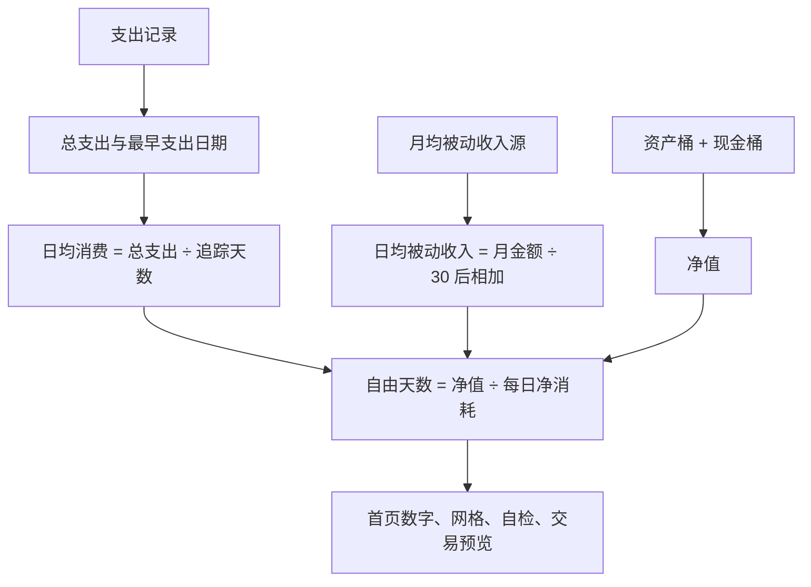

# FreeGrid 代码阅读地图

这份指南面向想看懂 App、暂时不打算从零写代码的人。先掌握一条完整路径：**页面收集输入 → 计算预览 → 保存记录 → 页面自动更新**。遇到问题时，沿这条路径判断卡在哪一步。

## 1. 文件夹就是职责边界

```text
FreeGrid/
├── App/          启动、四个 Tab、平台差异和启动失败页
├── Models/       哪些事实会保存到设备
├── Logic/        根据事实计算自由天数、预览、自检
├── Data/         打开数据库、保存/撤销、导入/导出
├── Features/     按功能组织的页面和弹窗
│   ├── Dashboard/    首页、主数字、自由网格、流星装饰
│   ├── Assets/       双桶、调拨、被动收入、导入确认
│   ├── Transactions/ 支出和收入表单
│   ├── Simulation/   模拟决策及格子动画
│   ├── History/      历史记录和月度汇总
│   └── Settings/     设置和财富自由自检
└── UI/           共用颜色、卡片、按钮、金额格式、预览和错误提示
```

`FreeGridTests/` 用具体输入验证计算和保存结果；`FreeGridUITests/` 模拟用户点击、输入、切换页面。`Assets.xcassets/` 放图标等素材，与显示钱的 Assets 页面不是同一回事。

## 2. 先读这六个入口

| 阅读顺序 | 文件 | 只需先回答的问题 |
|---|---|---|
| 1 | [ContentView](FreeGrid/App/ContentView.swift) | App 有哪四个页面？点击首页引导后怎样切到资产页？ |
| 2 | [LedgerModels](FreeGrid/Models/LedgerModels.swift) | 一笔支出究竟保存哪些字段？现金存在哪里？ |
| 3 | [AddExpenseSheet](FreeGrid/Features/Transactions/AddExpenseSheet.swift) | 用户填写哪些东西？保存按钮什么时候可用？ |
| 4 | [TransactionImpact](FreeGrid/Logic/TransactionImpact.swift) | 如果记下这笔，净值、日均消费和自由天数会怎样变化？ |
| 5 | [LedgerStore](FreeGrid/Data/LedgerStore.swift) | 什么时候真正写入？失败怎么办？撤销怎样还原？ |
| 6 | [DashboardView](FreeGrid/Features/Dashboard/DashboardView.swift) | 保存后，新数字如何出现在首页？ |

可以暂时跳过动画的数学、JSON 兼容细节和 macOS 条件分支。它们有独立文件，等需要改对应功能时再读。

## 3. 保存的是事实，其他数字由事实算出

[LedgerModels](FreeGrid/Models/LedgerModels.swift) 包含五种持久化模型：

| 类型 | 意义 | 典型字段 |
|---|---|---|
| `Expense` | 一笔支出 | `amount` 金额、`category` 分类、`date` 消费日期、`note` 备注 |
| `Income` | 一笔收入 | `amount` 金额、`source` 来源、`date` 日期 |
| `UserAssets` | 资产和现金的当前余额，约定只有一行 | `lockedAssets` 资产、`cash` 现金 |
| `PassiveSource` | 持续的月均被动收入源 | `monthlyAmount` 每月金额 |
| `Device` | 旧账里的持有物/设备 | 价格、购买日期、卖出信息；目前通过备份保留 |

`id` 是记录的身份证；`date` 是这笔钱发生的日期；`createdAt` 是创建记录的时间。补录去年消费时，后两者不同。

`FinancialSnapshot` 是**当前计算结果**：总支出、追踪天数、日均消费、净值、被动收入与自由状态。它没有 `@Model`，不会再保存一份数据库，也没有需要手动刷新的缓存。

正常情况下的计算路径：



[FreedomMath](FreeGrid/Logic/FreedomMath.swift) 负责这些规则。追踪天数从最早一笔支出算到今天，包含今天；只有收入或资产时，还没有消费基线。

自由状态有四种，代码用 `FreedomState` 区分：

- `insufficientData`：还没有支出，无法估计日均消费。
- `finite(days:)`：可以算出具体天数；净值小于零时按零天显示。
- `covered`：已有有效消费数据，被动收入足以覆盖日均消费。
- `invalidData`：已有数据无法正常计算，例如金额不是有限数字或日均消费不大于零。

因此 `—` 和 `∞` 意思不同，不能互相替代。旧账里的退款、零元记录仍然保留；若净支出导致日均无法计算，应显示无法计算的状态。

## 4. 跟着一笔“午餐 30 元”走完整条路

1. [AddExpenseSheet](FreeGrid/Features/Transactions/AddExpenseSheet.swift) 的 `@State amount` 保存输入框里的文字。此时还没有记账。
2. `Double(amount)` 尝试把文字转成金额；`isAmountValid` 检查金额、日期、备注长度和结果余额。
3. 页面用现有记录建立 `FinancialSnapshot`，再交给 `TransactionImpact` 算“如果保存”的结果。
4. [TransactionImpactView](FreeGrid/UI/TransactionImpactView.swift) 把结果画出来。支出表单、收入表单、模拟页共用它。
5. 点击保存后，`save()` 创建一条 `Expense`，调用 `LedgerStore.add(.expense(expense), in: modelContext)`。
6. `LedgerStore` 插入支出、现金减去 30、更新最早支出日期，并明确调用数据库保存。任何一步失败都会回滚，表单显示错误并保留输入。
7. 成功后才调用 `onSaved` 通知首页，再 `dismiss()` 关闭表单。
8. 首页的 `@Query` 读到新记录，重新生成摘要并绘制页面；撤销按钮调用 `LedgerStore.undo` 删除记录并反向调整现金。

假设目前现金 1000 元、今天已记支出 100 元、无其他资产或被动收入：再记午餐 30 元后，现金是 970 元，日均消费是 130 元，自由天数约 7.46 天。预览和真正保存之后用同一套计算规则。

**补录会改变统计区间。** 如果今天只记录了 100 元，补录九天前的一笔 1 元，日均从 100 变成 101 ÷ 10 = 10.1 元。即使现金减少，自由天数估计也可能增加。这反映的是统计区间变了；预览会提示这个原因。

## 5. 看懂最常出现的 Swift 写法

| 写法 | 在这个 App 中的意思 |
|---|---|
| `struct …: View` | 描述一个页面或 UI 部件 |
| `var body: some View` | 这个部件画什么、如何排列 |
| `VStack` / `HStack` | 竖着排 / 横着排 |
| `.font(...)` / `.padding(...)` | 调字体 / 留空白；这些点号调用依次修饰前面的 UI |
| `@State` | 当前页面记住的临时状态，例如输入金额、弹窗是否打开 |
| `@Query` | 从 SwiftData 取数据，并在相关数据变化后更新页面 |
| `@Model` | 这个类型的实例可作为数据库记录保存 |
| `@AppStorage` | 保存简单偏好，例如深色模式；这里不保存账目 |
| `@Environment(\.modelContext)` | 取得当前页面使用的数据库操作入口 |
| `$amount` | 让输入框既能读取 `amount`，也能把用户输入写回去 |
| `let` / `var` | 这个值不再赋新值 / 可以变化 |
| `String?` | 可能有一段文字，也可能没有（`nil`） |
| `guard … else { return }` | 条件不满足就提前退出 |
| `map` / `filter` / `reduce` | 逐项转换 / 挑出符合条件的项 / 合并成一个结果（常用于求和） |
| `switch` | 根据不同情况选择一段逻辑 |
| `try` / `catch` | 执行可能失败的操作 / 处理失败 |
| `@MainActor` | UI 与数据库模型的操作保持在主 actor 上协调 |
| `nonisolated` | 这些文件解析类型不依赖主 actor，可在后台解析与校验 JSON |

不必先背会语法；从文件中找到一个实例，对照它的实际输入输出理解。

## 6. 我要改哪里？

| 想改的内容 | 首先打开 |
|---|---|
| 页面顺序、Tab 名称 | `App/ContentView.swift` |
| 首页大数字、文案和两种布局 | `Features/Dashboard/DashboardHero.swift` |
| 首页卡片顺序、记账入口、首次引导 | `Features/Dashboard/DashboardView.swift` |
| 资产/现金颜色、卡片和按钮风格 | `UI/DesignSystem.swift` |
| 网格颜色、大小、呼吸动画 | `Features/Dashboard/LifeGrid.swift` |
| 支出分类 | `Logic/ExpenseCategory.swift` |
| 自由天数公式、日/月/年切换 | `Logic/FreedomMath.swift` |
| 记录这笔钱会产生什么影响 | `Logic/TransactionImpact.swift` |
| 实际扣现金、保存、撤销 | `Data/LedgerStore.swift` |
| 历史列表筛选、行样式 | `Features/History/HistoryView.swift` |
| 导入校验、兼容、去重、写入 | `Data/ImportValidation.swift` → `Data/DataIO.swift` |
| 启动时数据库打不开 | `Data/StoreBootstrap.swift` → `App/StoreRecoveryView.swift` |

颜色名字已与实际意义一致：`assetGold` 是资产金色，`cashBlue` 是现金蓝色。`assetCells` 是资产格数。

## 7. 出 Bug 时怎样缩小范围

- **输入以后预览就不对**：先记录输入金额、日期、已有资产和支出，再检查 `TransactionImpact`、`FinancialSnapshot`、`FreedomMath`。
- **预览正确，保存后数字不对**：看 `LedgerStore` 是否正确修改现金和日期，再看实际保存的数据。
- **保存数据正确，只是某个页面显示错**：看该页面以及 `FinancialFormatting`；金额符号和日/月/年单位属于显示层。
- **导入报错**：先看错误提示指向金额、日期、格式还是版本；`ImportValidator` 负责挡住不能接收的输入。
- **再次导入出现重复**：看 `DataIO.preview`。有 UUID 的备份按 UUID 识别；旧备份没有 UUID，只能按日期、金额、分类、备注识别，并兼容导入时的分类改写。
- **启动后出现恢复页**：看 `StoreBootstrap` 的诊断码。恢复页用于保留账本，不应通过直接删除数据库来“解决”。

无 UUID 的旧文件有固有歧义：两笔真实记录若内容完全相同，无法仅靠内容断定是不是同一笔；备注截断或导入后被改写也会限制识别。新备份保留 UUID。此次没有为了消除歧义而改变已有数据库字段或备份格式。

给 AI 报 Bug 时，可以直接写：

> 我在【页面】做了【操作】。输入和已有数据是【具体值】，期待【结果】，实际看到【结果】。先定位到负责这条规则的文件，给出原因和能复现的测试，再做最小修改。

## 8. 这次整理的取舍

- 页面按功能搬到独立文件。`ContentView` 只装配页面；首页主数字独立为 `DashboardHero`。
- 财务摘要、交易影响、预览 UI、保存/撤销各保留一份共用实现。
- 删除无调用的旧组件、旧颜色别名、重复格式化和计算。
- 保留五个持久化模型的字段、迁移、备份校验、回滚与启动恢复；这些保护已有账本。
- 不要求每个页面额外增加 ViewModel 或 Repository。小页面直接读数据、调用共用规则即可。

## 9. 怎样确认改完没坏

Xcode 中用 Product → Test 运行测试。业务规则变动时，先写一个能说清楚的输入输出用例，例如：退款 −30 元在历史页应显示 +¥30；保存失败后现金和记录都恢复原状。

此次新增的回归入口：

- [TransactionImpactTests](FreeGridTests/TransactionImpactTests.swift)：单位切换、补录、首次记账、被动覆盖、退款和小于一格的变化。
- [LedgerStoreTests](FreeGridTests/LedgerStoreTests.swift)：保存失败、撤销失败、重复撤销、退款撤销和五模型清空回滚。
- [LegacyImportIdentityTests](FreeGridTests/LegacyImportIdentityTests.swift)：旧分类映射、长备注、旧随机 UUID 与重复导入。

构建和模拟器测试不能替代真机体验。发布之前仍需用真机确认输入、键盘、布局和真实备份恢复。

## 10. 三道阅读自测

1. 模拟页为什么不会真的扣现金？
2. 现金和支出为什么必须一起保存？
3. 只录入工资，为什么首页还可能显示 `—`？

<details>
<summary>读完代码后再展开答案</summary>

1. 模拟页只创建 `FinancialSnapshot` 和 `TransactionImpact`；没有调用 `LedgerStore.add`，也没有写入数据库。
2. 如果只保存一半，就会出现“有支出但现金没扣”或“扣了现金却找不到支出”。`LedgerStore.perform` 将两者放在一起保存，失败一起回滚。
3. 工资提供现金，不提供消费基线；`FreedomState.insufficientData` 要等第一笔支出后才能重新判断。

</details>
